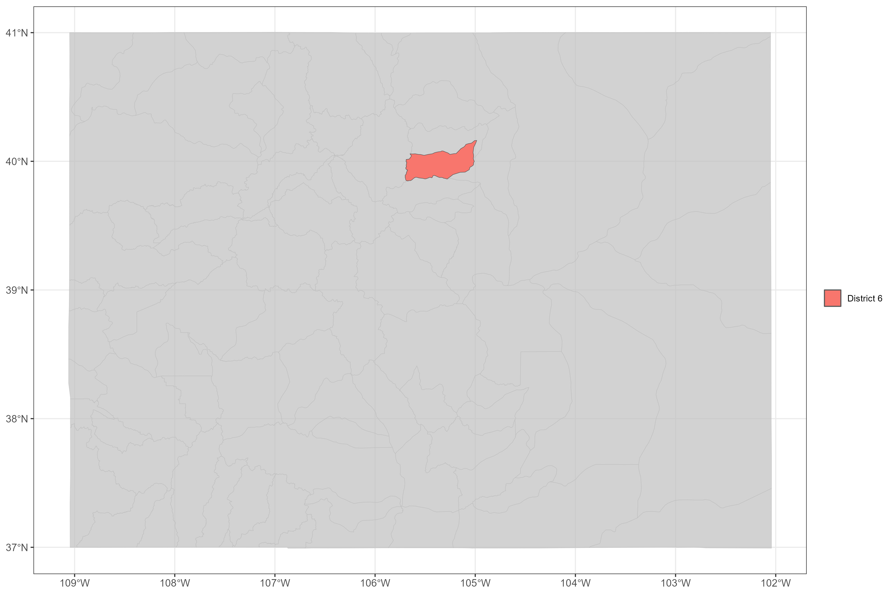

```{r, include = FALSE}
knitr::opts_chunk$set(
  collapse = TRUE,
  comment = "#>",
  # fig.path = "man/figures/README-",
  out.width = "100%"
)

library(sf)
library(cdssr)
library(nhdplusTools)
library(dplyr)
library(ggplot2)

districts <- sf::read_sf("data/water_districts_simple.geojson")
names(districts) <- tolower(names(districts))

thm <- 
  ggplot2::theme_bw() +
  ggplot2::theme(
    plot.title = ggplot2::element_text(size = 14),
    axis.text  = ggplot2::element_text(size = 10)
  )

group_colors <- c(
  "4" = "#F8766D",
  "5" = "#00BA38",
  "6" = "#619CFF"
  )
```
# [**cpo**](https://github.com/anguswg-ucsb/cpo)
CPO data collection, aggregation, and analysis code repository 

The primary function of this repository is to provide reproducible scripts for collecting and summarizing water rights and climate data for the state of Colorado. 

<br>

## Data sources:

### Water Rights data sources:

1. CDSS/DWR via [cdssr](https://github.com/anguswg-ucsb/cdssr)

<br>

### Climate data sources:

1. SWE from NRCS SNOTEL sites

2. NRCS streamflow forecasts

3. EDDI (Evaporative Drought Demand Index)


The main script in this repository is the `get_everything()` script that when run, will pull together all available data from the sources above and summarize the data into an annual value for every point (water right) in each district.

## Data Collection steps:

<br>

### Area of Interest

For each water district in Colorado, we collect the same set of water right and climate data indicators. Below is a plot showing the different water district boundaries in Colorado. 

```{r, eval = FALSE, echo = FALSE}
# code for creating a map of all water districts in colorado 

districts_plot <- 
  districts %>% 
  dplyr::mutate(
    district = as.character(district),
    basin    = as.character(basin)
    ) %>% 
  ggplot2::ggplot() +
  ggplot2::geom_sf(ggplot2::aes(fill = basin)) +
  ggplot2::labs(
    # title = "Colorado water districts by basin",
    fill = ""
  ) +
  thm

ggplot2::ggsave(
  districts_plot,
  filename = "img/districts_plot.png",
  width    = 12,
  height   = 8,
  scale    = 1
  )

```


### Pick a district from district shapefile

We loop through each one of the water districts and apply the same data collection process for each water district. 
For this example, we will walk through the data collection process for a single district, district 6. 
```{r, eval = TRUE, echo = TRUE}
# subset to example district 6
aoi <-
  districts %>% 
  dplyr::filter(district == 6) %>% 
  dplyr::select(district, division, basin, name, geometry)

aoi
```


```{r, eval = FALSE, echo = FALSE}
# code for creating a map of all water districts in colorado 
aoi_plot <- 
  districts %>% 
  dplyr::mutate(
    district = paste0("District ", as.character(district)),
    basin    = as.character(basin)
    ) %>% 
  ggplot2::ggplot() +
  ggplot2::geom_sf(ggplot2::aes(fill = district)) +
  gghighlight::gghighlight(district == "District 6") +
  ggplot2::labs(
    # title = "Colorado water districts by basin",
    fill = ""
  ) +
  thm
# aoi_plot
ggplot2::ggsave(
  aoi_plot,
  filename = "img/aoi_plot.png",
  width    = 12,
  height   = 8,
  scale    = 1
  )

```



<br>

### Retrieve all river networks for the AOI
Use `NHDPlusTools`
First thing we do is we get NHDPlus flowlines for each district like so:

```{r, eval = TRUE, echo = TRUE}
flowlines <- nhdplusTools::get_nhdplus(AOI = aoi)

nrow(flowlines)
```

We've got 327 unique flowlines in district 6.

```{r, eval = FALSE, echo = FALSE}
# code for creating making an NHDPlus flowlines plot
fline_plot <- 
  # flowlines %>% 
  # dplyr::mutate(
  #   district = paste0("District ", as.character(district)),
  #   basin    = as.character(basin)
  #   ) %>%
  ggplot2::ggplot() +
  ggplot2::geom_sf(data = aoi) +
  ggplot2::geom_sf(data = flowlines, color = "dodgerblue3") +
  # gghighlight::gghighlight(district == "District 6") +
  ggplot2::labs(
    # title = "Colorado water districts by basin",
    fill = ""
  ) +
  thm
# fline_plot
ggplot2::ggsave(
  fline_plot,
  filename = "img/fline_plot.png",
  width    = 12,
  height   = 8,
  scale    = 1
  )
```


<br>

### Subset to the largest/mainstem rivers
By stream level

We remove any divergent flowlines (streamcalc != 0) and then get a list of all the unique streamlevels in our AOI. Below are the unique streamlevels in ascending order:
```{r, eval = TRUE, echo = TRUE}
streamlevels <- sort(unique(dplyr::filter(flowlines, streamcalc != 0)$streamleve))
```

We then select the top 2 largest streamlevels in our AOI
```{r}
streamlevels <- streamlevels[1:3]
streamlevels
```

We then make sure to filter out any extraneous flowlines that are outside the bounds of the AOI. We are then left with the top 3 most promiment flowlines by streamlevel in our particular district of interest. From each streamlevel, we then found the most downstream flowline on that streamlevel by using the minimum Hydroseq attribute. We then navigate up the river network, following the mainstem of the river and find the most upstream flowline along the mainstem. The most upstream flowline along the mainstem path of each streamlevel will end up being the points we will use to decide which water rights (WDIDs) we will select for each district. This process is illustrated in the gif below.


```{r, eval = FALSE, echo = FALSE}

# CODE FOR MAKING STREAMLEVELING GIF
# flowlines %>% 
#   dplyr::mutate(
#     streamleve = as.character(streamleve)
#     ) %>%
#   ggplot2::ggplot() +
#   ggplot2::geom_sf(ggplot2::aes(color = streamleve))
# 
# 
start_plot <- 
  flowlines %>%
  # sf::st_filter(
  #   aoi, .predicate = st_within
  # ) %>%
    # net2 %>% 
      # dplyr::bind_rows(net1, net2) %>% 
  dplyr::mutate(
    streamleve = as.character(streamleve)
    ) %>%
  ggplot2::ggplot() +
  ggplot2::geom_sf(data = aoi) +
  ggplot2::geom_sf(ggplot2::aes(color = streamleve)) +
      # gghighlight::gghighlight(comid %in% downs$comid) +
  ggplot2::scale_color_manual(values=group_colors) +
  # gghighlight::gghighlight(streamleve %in% streamlevels) +
  gghighlight::gghighlight(comid %in% "00000000000") +
  # ggplot2::geom_sf(data = downs, fill = "black") +
  ggplot2::labs(
      # title = paste0("Streamlevel: ", streamlevels[i]),
      color = "Streamlevel",
   caption = "( 1 / 10 )"
    ) +
  thm +
  ggplot2::theme(
    legend.position = "none",
    plot.caption    = ggplot2::element_text(size = 12, face="bold", hjust = 0.5),
    #   legend.justification = c(-.5,-3.4),
    # legend.position      = c(0,0),
    # legend.background    = ggplot2::element_rect(fill="transparent", size=.5, linetype = "dotted")
    ) 

ggplot2::ggsave(
    start_plot,
    filename = paste0("./img/00_streamlevel_plot.png"),
    width = 12,
    height = 9,
    scale = 1
  )

slvl_plot1 <- 
  flowlines %>%
  dplyr::mutate(
    streamleve = as.character(streamleve)
    ) %>%
  ggplot2::ggplot() +
  ggplot2::geom_sf(data = aoi) +
  ggplot2::geom_sf(ggplot2::aes(color = streamleve)) +
  ggplot2::scale_color_manual(values=group_colors) +
  gghighlight::gghighlight(streamleve %in% streamlevels) +
  # ggplot2::scale_color_manual(values = c( "forestgreen", "red", "dodgerblue3")) +
   # ggplot2::scale_fill_manual(values=group_colors) +
  ggplot2::labs(
      # title = paste0("Streamlevel: ", streamlevels[i]),
      color = "Streamlevel",
   caption = "( 2 / 10 )"
    ) +
  thm +
  ggplot2::theme(
    legend.position = "none",
    plot.caption    = ggplot2::element_text(size = 12, face="bold", hjust = 0.5),
    #   legend.justification = c(-.5,-3.4),
    # legend.position      = c(0,0),
    # legend.background    = ggplot2::element_rect(fill="transparent", size=.5, linetype = "dotted")
    ) 

ggplot2::ggsave(
    slvl_plot1,
    filename = paste0("./img/01_streamlevel_plot.png"),
    width = 12,
    height = 9,
    scale = 1
  )

filt_strmlvl_plot <- 
  flowlines %>%
  sf::st_filter(
    aoi, .predicate = st_within
  ) %>% 
  dplyr::mutate(
    streamleve = as.character(streamleve)
    ) %>%
  ggplot2::ggplot() +
  ggplot2::geom_sf(data = aoi) +
  ggplot2::geom_sf(ggplot2::aes(color = streamleve)) +
  ggplot2::scale_color_manual(values=group_colors) +
  gghighlight::gghighlight(streamleve %in% streamlevels) +
  # ggplot2::scale_color_manual(values=group_colors) +
  # ggplot2::scale_color_manual(values=group_colors) +
  ggplot2::labs(
      # title = paste0("Streamlevel: ", streamlevels[i]),
      color = "Streamlevel",
   caption = "( 3 / 10 )"
    ) +
  thm +
  ggplot2::theme(
    legend.position = "none",
    plot.caption    = ggplot2::element_text(size = 12, face="bold", hjust = 0.5),
    #   legend.justification = c(-.5,-3.4),
    # legend.position      = c(0,0),
    # legend.background    = ggplot2::element_rect(fill="transparent", size=.5, linetype = "dotted")
    ) 

ggplot2::ggsave(
    filt_strmlvl_plot,
    filename = paste0("./img/02_streamlevel_plot.png"),
    width = 12,
      height = 9,
    scale = 1
  )

downs <- 
  flowlines %>% 
  dplyr::filter(streamcalc != 0) %>%
  dplyr::filter(streamleve %in% streamlevels) %>%
  sf::st_filter(
    aoi, .predicate = st_within
  ) %>% 
        # dplyr::filter(streamorde >= 2) %>%
        dplyr::mutate(dplyr::across(c(-geometry), as.character)) %>%
        dplyr::group_by(streamleve) %>%
        dplyr::slice_min(hydroseq) %>% 
  sf::st_centroid() %>% 
  sf::st_buffer(250)

ds_pts_plot <-
  flowlines %>%
  sf::st_filter(
    aoi, .predicate = st_within
  ) %>% 
  dplyr::mutate(
    streamleve = as.character(streamleve)
    ) %>%
  ggplot2::ggplot() +
  ggplot2::geom_sf(data = aoi) +
  ggplot2::geom_sf(ggplot2::aes(color = streamleve)) +
      # gghighlight::gghighlight(comid %in% downs$comid) +
  ggplot2::scale_color_manual(values=group_colors) +
  gghighlight::gghighlight(streamleve %in% streamlevels) +
    ggplot2::geom_sf(data = downs, fill = "black") +
  # ggplot2::geom_sf(data = sf::st_buffer(sf::st_centroid(downs), 250), fill = "black") +
  ggplot2::labs(
      # title = paste0("Streamlevel: ", streamlevels[i]),
      color = "Streamlevel",
   caption = "( 4 / 10 )"
    ) +
  thm +
  ggplot2::theme(
    legend.position = "none",
    plot.caption    = ggplot2::element_text(size = 12, face="bold", hjust = 0.5),
    #   legend.justification = c(-.5,-3.4),
    # legend.position      = c(0,0),
    # legend.background    = ggplot2::element_rect(fill="transparent", size=.5, linetype = "dotted")
    ) 
ggplot2::ggsave(
    ds_pts_plot,
    filename = paste0("./img/03_streamlevel_plot.png"),
    width = 12,
    height = 9,
    scale = 1
  )

# downs
# for (i in 1:nrow(downs)) {
#   i = 1
net1 <- 
  nhdplusTools::navigate_network(
    start = as.integer(downs[1, ]$comid),
    mode = "UM",
    distance_km = 300
  ) %>% 
  dplyr::mutate(origin_comid = as.integer(downs[1, ]$comid))

net2 <- 
  nhdplusTools::navigate_network(
    start = as.integer(downs[2, ]$comid),
    mode = "UM",
    distance_km = 300
  ) %>% 
  dplyr::mutate(origin_comid = as.integer(downs[2, ]$comid))

full_net <- dplyr::bind_rows(net1, net2)
  # net$geometry %>% plot()
  # sl <- downs[i, ]$streamleve
  #       main_coms <- dplyr::bind_rows(net1, net2)
  # main_coms$comid

no_flines_plot <- 
  flowlines %>%
  sf::st_filter(
    aoi, .predicate = st_within
  ) %>%
    # net2 %>% 
      # dplyr::bind_rows(net1, net2) %>% 
  dplyr::mutate(
    streamleve = as.character(streamleve)
    ) %>%
  ggplot2::ggplot() +
  ggplot2::geom_sf(data = aoi) +
  ggplot2::geom_sf(ggplot2::aes(color = streamleve)) +
      # gghighlight::gghighlight(comid %in% downs$comid) +
  ggplot2::scale_color_manual(values=group_colors) +
  # gghighlight::gghighlight(streamleve %in% streamlevels) +
  gghighlight::gghighlight(comid %in% "00000000000") +
  ggplot2::geom_sf(data = downs, fill = "black") +
  ggplot2::labs(
      # title = paste0("Streamlevel: ", streamlevels[i]),
      color = "Streamlevel",
        caption = "( 5 / 10 )"
    ) +
  thm +
  ggplot2::theme(
    legend.position = "none",
    plot.caption    = ggplot2::element_text(size = 12, face="bold", hjust = 0.5),
    #   legend.justification = c(-.5,-3.4),
    # legend.position      = c(0,0),
    # legend.background    = ggplot2::element_rect(fill="transparent", size=.5, linetype = "dotted")
    ) 

ggplot2::ggsave(
    no_flines_plot,
    filename = paste0("./img/04_streamlevel_plot.png"),
    width = 12,
    height = 9,
    scale = 1
  )

mainstem1_plot <- 
  flowlines %>%
  sf::st_filter(
    aoi, .predicate = st_within
  ) %>%
    # net2 %>% 
      # dplyr::bind_rows(net1, net2) %>% 
  dplyr::mutate(
    streamleve = as.character(streamleve)
    ) %>%
  ggplot2::ggplot() +
  ggplot2::geom_sf(data = aoi) +
  ggplot2::geom_sf(ggplot2::aes(color = streamleve)) +
      # gghighlight::gghighlight(comid %in% downs$comid) +
  ggplot2::scale_color_manual(values=group_colors) +
  # gghighlight::gghighlight(streamleve %in% streamlevels) +
  gghighlight::gghighlight(comid %in% net1$comid) +
  ggplot2::geom_sf(data = downs, fill = "black") +
  ggplot2::labs(
      # title = paste0("Streamlevel: ", streamlevels[i]),
      color = "Streamlevel",
       caption = "( 6 / 10 )"
    ) +
  thm +
  ggplot2::theme(
    legend.position = "none",
    plot.caption    = ggplot2::element_text(size = 12, face="bold", hjust = 0.5),
    #   legend.justification = c(-.5,-3.4),
    # legend.position      = c(0,0),
    # legend.background    = ggplot2::element_rect(fill="transparent", size=.5, linetype = "dotted")
    ) 

ggplot2::ggsave(
    mainstem1_plot,
    filename = paste0("./img/05_streamlevel_plot.png"),
    width = 12,
    height = 9,
    scale = 1
  )

mainstem2_plot <- 
  flowlines %>%
  sf::st_filter(
    aoi, .predicate = st_within
  ) %>%
    # net2 %>% 
      # dplyr::bind_rows(net1, net2) %>% 
  dplyr::mutate(
    streamleve = as.character(streamleve)
    ) %>%
  ggplot2::ggplot() +
  ggplot2::geom_sf(data = aoi) +
  ggplot2::geom_sf(ggplot2::aes(color = streamleve)) +
      # gghighlight::gghighlight(comid %in% downs$comid) +
  ggplot2::scale_color_manual(values=group_colors) +
  # gghighlight::gghighlight(streamleve %in% streamlevels) +
  gghighlight::gghighlight(comid %in% c(net1$comid, net2$comid)) +
  ggplot2::geom_sf(data = downs, fill = "black") +
  ggplot2::labs(
      # title = paste0("Streamlevel: ", streamlevels[i]),
      color = "Streamlevel",
       caption = "( 7 / 10 )"
    ) +
  thm +
  ggplot2::theme(
    legend.position = "none",
    plot.caption    = ggplot2::element_text(size = 12, face="bold", hjust = 0.5),
    #   legend.justification = c(-.5,-3.4),
    # legend.position      = c(0,0),
    # legend.background    = ggplot2::element_rect(fill="transparent", size=.5, linetype = "dotted")
    ) 
# ggplot2::coord_fixed(ratio=10)
ggplot2::ggsave(
    mainstem2_plot,
    filename = paste0("./img/06_streamlevel_plot.png"),
    width = 12,
    height = 9,
    scale = 1
  )

max_pts <- 
  full_net  %>% 
  dplyr::group_by(origin_comid) %>% 
  dplyr::slice_max(hydroseq) %>% 
  sf::st_centroid() %>% 
  sf::st_buffer(250)

max_pts_plot <-
  flowlines %>%
  sf::st_filter(
    aoi, .predicate = st_within
  ) %>%
    # net2 %>% 
      # dplyr::bind_rows(net1, net2) %>% 
  dplyr::mutate(
    streamleve = as.character(streamleve)
    ) %>%
  ggplot2::ggplot() +
  ggplot2::geom_sf(data = aoi) +
  ggplot2::geom_sf(ggplot2::aes(color = streamleve)) +
      # gghighlight::gghighlight(comid %in% downs$comid) +
  ggplot2::scale_color_manual(values=group_colors) +
  # gghighlight::gghighlight(streamleve %in% streamlevels) +
  gghighlight::gghighlight(comid %in% c(net1$comid, net2$comid)) +
  ggplot2::geom_sf(data = downs, fill = "black") +
  ggplot2::geom_sf(data = max_pts, fill = "black") +
  ggplot2::labs(
      # title = paste0("Streamlevel: ", streamlevels[i]),
      color = "Streamlevel",
      caption = "( 8 / 10 )"
    ) +
  thm +
  ggplot2::theme(
    legend.position = "none",
    plot.caption    = ggplot2::element_text(size = 12, face="bold", hjust = 0.5),
    #   legend.justification = c(-.5,-3.4),
    # legend.position      = c(0,0),
    # legend.background    = ggplot2::element_rect(fill="transparent", size=.5, linetype = "dotted")
    ) 
  
ggplot2::ggsave(
    max_pts_plot,
    filename = paste0("./img/07_streamlevel_plot.png"),
    width = 12,
    height = 9,
    scale = 1
  )

max_pts_plot2 <-
  flowlines %>%
  sf::st_filter(
    aoi, .predicate = st_within
  ) %>%
    # net2 %>% 
      # dplyr::bind_rows(net1, net2) %>% 
  dplyr::mutate(
    streamleve = as.character(streamleve)
    ) %>%
  ggplot2::ggplot() +
  ggplot2::geom_sf(data = aoi) +
  ggplot2::geom_sf(ggplot2::aes(color = streamleve)) +
      # gghighlight::gghighlight(comid %in% downs$comid) +
  ggplot2::scale_color_manual(values=group_colors) +
  # gghighlight::gghighlight(streamleve %in% streamlevels) +
  gghighlight::gghighlight(comid %in% c(net1$comid, net2$comid)) +
    # gghighlight::gghighlight(comid %in% c(net1$comid) +
  # ggplot2::geom_sf(data = downs, fill = "black") +
  ggplot2::geom_sf(data = max_pts, fill = "black") +
  ggplot2::labs(
      # title = paste0("Streamlevel: ", streamlevels[i]),
      color = "Streamlevel",
      caption = "( 9 / 10 )"
    ) +
  thm +
  ggplot2::theme(
    legend.position = "none",
    plot.caption    = ggplot2::element_text(size = 12, face="bold", hjust = 0.5),
    #   legend.justification = c(-.5,-3.4),
    # legend.position      = c(0,0),
    # legend.background    = ggplot2::element_rect(fill="transparent", size=.5, linetype = "dotted")
    ) 
  
ggplot2::ggsave(
    max_pts_plot2,
    filename = paste0("./img/08_streamlevel_plot.png"),
    width = 12,
    height = 9,
    scale = 1
  )


max_pts_plot3 <-
  flowlines %>%
  sf::st_filter(
    aoi, .predicate = st_within
  ) %>%
    # net2 %>% 
      # dplyr::bind_rows(net1, net2) %>% 
  dplyr::mutate(
    streamleve = as.character(streamleve)
    ) %>%
  ggplot2::ggplot() +
  ggplot2::geom_sf(data = aoi) +
  ggplot2::geom_sf(ggplot2::aes(color = streamleve)) +
      # gghighlight::gghighlight(comid %in% downs$comid) +
  ggplot2::scale_color_manual(values=group_colors) +
  # gghighlight::gghighlight(streamleve %in% streamlevels) +
  gghighlight::gghighlight(comid %in% "00000000000000000") +
    # gghighlight::gghighlight(comid %in% c(net1$comid) +
  # ggplot2::geom_sf(data = downs, fill = "black") +
  ggplot2::geom_sf(data = sf::st_buffer(max_pts, 100), fill = "red") +
  ggplot2::labs(
      # title = paste0("Streamlevel: ", streamlevels[i]),
      color = "Streamlevel",
      caption = "( 10 / 10 )"
    ) +
  thm +
  ggplot2::theme(
    legend.position = "none",
    plot.caption    = ggplot2::element_text(size = 12, face="bold", hjust = 0.5),
    #   legend.justification = c(-.5,-3.4),
    # legend.position      = c(0,0),
    # legend.background    = ggplot2::element_rect(fill="transparent", size=.5, linetype = "dotted")
    ) 
  
ggplot2::ggsave(
    max_pts_plot3,
    filename = paste0("./img/09_streamlevel_plot.png"),
    width = 12,
    height = 9,
    scale = 1
  )
# library(gifski)
# paths <- c("./img/01_streamlevel_plot.png", "./img/02_streamlevel_plot.png", "./img/03_streamlevel_plot.png")
paths <- sort(list.files("img", pattern = "_streamlevel_plot", full.names = T))
gifski::gifski(paths,
                gif_file = "gif/downstream_points.gif",
                width = 2000,
                height =1400,
                delay = 1.5,
                loop = TRUE,
                progress = TRUE
                )
# start_flines <- nhdplusTools::make_standalone(flowlines) %>% 
#   dplyr::filter(StartFlag == 1)
# start_flines %>% unique()
# mainstem2_plot
```


```{r, eval = FALSE, echo = FALSE}
term <- 
  flowlines %>% 
  .$terminalpa %>% 
  unique()
flowlines %>% 
  dplyr::filter(hydroseq == term)

term_hs <- 
  flowlines %>% 
  nhdplusTools::make_standalone() %>% 
    .$TerminalPa %>% 
  unique()
term_comid <- 
  flowlines %>% 
  dplyr::filter(hydroseq %in% term_hs)
flowlines %>% 
  dplyr::filter(hydroseq == term_hs) %>% 
  mapview::mapview() + flowlines
net2 <- nhdplusTools::navigate_network(
  start = term_comid$comid,
  distance_km = 100,
  mode = "UT"
)

plot(net2$geometry)
starts <- 
  net2 %>% 
  dplyr::filter(startflag == 1)

flowlines %>% 
  dplyr::filter(startflag == 1)
```


```{r, eval = FALSE, echo = FALSE}
# flowlines %>% 
#   dplyr::mutate(
#     streamleve = as.character(streamleve)
#     ) %>%
#   ggplot2::ggplot() +
#   ggplot2::geom_sf(ggplot2::aes(color = streamleve))
# 
# 

# ### Determine most upstream point of river network
# We'll use this point to determine which water right we want to use/get data for
# 
# <br>

slvl_plot <- 
  flowlines %>%
  dplyr::mutate(
    streamleve = as.character(streamleve)
    ) %>%
  ggplot2::ggplot() +
  ggplot2::geom_sf(ggplot2::aes(color = streamleve)) +
  gghighlight::gghighlight(streamleve %in% streamlevels)


for (i in 1:length(streamlevels)) {
  # streamlevels[i]
  message("i: ", i)
  message("Streamlevel: ", streamlevels[i])
  
  # i = 3
  strm_lvls_plot <- 
    flowlines %>% 
    dplyr::mutate(
      streamleve = as.character(streamleve)
      ) %>%
    # dplyr::slice_min(hydroseq) %>% 
    ggplot2::ggplot() +
    ggplot2::geom_sf(ggplot2::aes(color = streamleve)) + 
      # gghighlight::gghighlight(hydroseq == min(hydroseq))
    gghighlight::gghighlight(streamleve %in% streamlevels[i]) +
    ggplot2::labs(
      title = paste0("Streamlevel: ", streamlevels[i]),
      color = ""
    ) +
    thm
  
  
  min_com <-
    flowlines %>% 
    dplyr::mutate(
      streamleve = as.character(streamleve)
      ) %>% 
    dplyr::filter(streamleve %in% streamlevels[i]) %>% 
    dplyr::slice_min(hydroseq) %>% 
      .$comid

  min_com_plot <- 
    flowlines %>%
    dplyr::mutate(flowlines,
      streamleve = as.character(streamleve),
      comid_label = ifelse(comid == min_com, "Minimum downstream COMID", "")
      ) %>%
    ggplot2::ggplot() + 
    ggplot2::geom_sf( ggplot2::aes(color = streamleve)) + 
    gghighlight::gghighlight(streamleve %in% streamlevels[i]) +
    ggplot2::geom_sf(data = sf::st_buffer(
                                    sf::st_centroid(
                                      dplyr::filter(flowlines, comid == min_com)
                                      ), 350
                                    ), fill = "black"
                                  ) +
    ggplot2::labs(
      title = paste0("Streamlevel: ", streamlevels[i]),
      color = ""
    ) +
    thm
    # ggplot2::geom_sf_label(data = sf::st_buffer(
    #                                 sf::st_centroid(
    #                                   dplyr::filter(    
    #                                     dplyr::mutate(
    #                                       flowlines,
    #                                       comid_label = ifelse(comid == min_com, "Minimum downstream COMID", "")
    #                                       ), 
    #                                     comid == min_com)
    #                                   ), 
    #                                 350
    #                                 ),
    #                        ggplot2::aes(label = comid_label)
    #                        # fill = "black"
    #                        ) 
      # gghighlight::gghighlight(hydroseq == min(hydroseq))
    # gghighlight::gghighlight(comid == min_com, label_key   = stream)
    # ggrepel::geom_label_repel()
  net2 <- nhdplusTools::navigate_network(
          start    = as.integer(unique(min_com)),
          mode     = "UM",
          distance = 300
        ) %>%
          dplyr::mutate(dplyr::across(c(-geometry), as.character)) %>% 
    dplyr::mutate(
      strmlvl_label = paste0("Streamlevel ", streamlevels[i], " mainstem")
    )

  mainstem_plot <- 
    flowlines %>%
    dplyr::mutate(flowlines,
      streamleve = as.character(streamleve),
      is_mainstem = ifelse(comid %in% net2$comid, "Mainstem", "Other"),
      # strmlvl_label = ifelse(is_mainstem, paste0("Streamlevel ", streamlevels[i], " mainstem"), "")
      strmlvl_label = ifelse(is_mainstem, paste0("Streamlevel ", streamlevels[i], " mainstem"), "")
        ) %>%
    ggplot2::ggplot() + 
    ggplot2::geom_sf( ggplot2::aes(color = is_mainstem)) + 
    # gghighlight::gghighlight(is_mainstem == TRUE) +
        # gghighlight::gghighlight(streamleve %in% streamlevels[i]) +
    ggplot2::labs(
      title = paste0("Streamlevel: ", streamlevels[i]),
      color = ""
    ) +
    thm 
    # ggplot2::theme(
    #   legend.position = "bottom"
    # )
    # ggplot2::geom_sf(data = sf::st_buffer(
    #                                 sf::st_centroid(
    #                                   dplyr::filter(flowlines, comid == min_com)
    #                                   ), 350
    #                                 ), fill = "black"
    #                               ) +
    # thm
  mainstem_only_plot <- 
    flowlines %>%
    dplyr::mutate(flowlines,
      streamleve = as.character(streamleve),
      is_mainstem = ifelse(comid %in% net2$comid, "Mainstem", "Other"),
      # strmlvl_label = ifelse(is_mainstem, paste0("Streamlevel ", streamlevels[i], " mainstem"), "")
      strmlvl_label = ifelse(is_mainstem, paste0("Streamlevel ", streamlevels[i], " mainstem"), "")
        ) %>%
    ggplot2::ggplot() + 
    ggplot2::geom_sf( ggplot2::aes(color = is_mainstem)) + 
    gghighlight::gghighlight(is_mainstem == TRUE) +
        # gghighlight::gghighlight(streamleve %in% streamlevels[i]) +
    ggplot2::labs(
      title = paste0("Streamlevel: ", streamlevels[i]),
      color = ""
    ) +
    thm 
  
  message(paste0("/img/",  ifelse(i < 10, paste0("0", i), i), "_streamlevel_gif_plot.png"))
  message(paste0("/img/",  ifelse(i+1 < 10, paste0("0",i+1), i+1), "_streamlevel_gif_plot.png"))
  message(paste0("/img/",  ifelse(i+2 < 10, paste0("0", i+2), i+2), "_streamlevel_gif_plot.png"))
  message(paste0("/img/",  ifelse(i+3 < 10, paste0("0", i+3), i+3), "_streamlevel_gif_plot.png"))
  # strm_lvls_plot
  # min_com_plot
  # mainstem_plot
  # mainstem_only_plot
  # ifelse(i < 10, paste0("0", i), i)
  ggplot2::ggsave(
    strm_lvls_plot,
    filename = paste0("./img/",  ifelse(i < 10, paste0("0", i), i), "_streamlevel_gif_plot.png"),
    width = 12,
    height = 8,
    scale = 1
  )
  
  ggplot2::ggsave(
    min_com_plot,
    filename = paste0("./img/",  ifelse(i+1 < 10, paste0("0",i+1), i+1), "_streamlevel_gif_plot.png"),
    width = 12,
    height = 8,
    scale = 1
  )
  
   ggplot2::ggsave(
    mainstem_plot,
    filename = paste0("./img/",  ifelse(i+2 < 10, paste0("0",i+2), i+2), "_streamlevel_gif_plot.png"),
    width = 12,
    height = 8,
    scale = 1
  )
   
  ggplot2::ggsave(
    mainstem_only_plot,
    filename = paste0("./img/",  ifelse(i+3 < 10, paste0("0",i+3), i+3), "_streamlevel_gif_plot.png"),
    width = 12,
    height = 8,
    scale = 1
  )
  
}
# flowlines %>% 
#   dplyr::mutate(
#     streamleve = as.character(streamleve)
#     ) %>%
#   ggplot2::ggplot() +
#   ggplot2::geom_sf(ggplot2::aes(color = streamleve)) + 
#   gghighlight::gghighlight(streamleve %in% streamlevels)

# plot(net2$geometry)
# 
#  tmp <- flowlines %>%
#     dplyr::mutate(flowlines,
#       streamleve = as.character(streamleve),
#       is_mainstem = ifelse(comid %in% net2$comid, TRUE, FALSE),
#       strmlvl_label = ifelse(is_mainstem, paste0("Streamlevel ", streamlevels[i], " mainstem"), "")
#         )
 mainstem_plot
```

<br>

### Get all water rights within AOI
Now that we have identified the mainstems within our AOI, and the most upstream flowlines of these mainstems, we can use these upstream points to identify the water rights we want to select for each district. First we'll get all the relevant water rights for the district, and remove any missing data.

```{r}
# get water rights information around most upstream of mainstems
water_rights <- cdssr::get_water_rights_netamount(
              water_district = "6"
              )

pts <-
  water_rights %>%
  dplyr::tibble() %>%
  dplyr::mutate(
    lon     = longitude,
    lat     = latitude,
    gnis_id = sub("^0+", "", gnis_id)
  ) %>%
  # dplyr::filter(wdid == "0604255") %>%
  dplyr::filter(!is.na(longitude) | !is.na(latitude)) %>%
  sf::st_as_sf(coords = c("longitude", "latitude"), crs = 4326) %>% 
  sf::st_filter(aoi) 
```

```{r, eval = FALSE, echo = FALSE}

  # dplyr::mutate(  
  #   sf::st_filter(flowlines,  aoi, .predicate = st_within),
  #   streamleve = as.character(streamleve)
  #   ) %>%
  # ggplot2::ggplot() +
  # ggplot2::geom_sf(data = aoi) +
  # ggplot2::geom_sf(data =  dplyr::mutate(  
  #   sf::st_filter(flowlines,  aoi, .predicate = st_within),
  #   streamleve = as.character(streamleve)
  #   ), ggplot2::aes(color = streamleve)) +
  #   gghighlight::gghighlight(comid %in% "00000000000") 
  #     # gghighlight::gghighlight(comid %in% downs$comid) +
  # ggplot2::scale_color_manual(values=group_colors) +
  # # gghighlight::gghighlight(streamleve %in% streamlevels) +
  # gghighlight::gghighlight(comid %in% "00000000000") 

wr_pts_plot <-
  ggplot2::ggplot() +
  ggplot2::geom_sf(data = aoi) +
  # ggplot2::geom_sf(data = pts) +
  # ggplot2::geom_sf(data = sf::st_buffer(max_pts, 100), fill = "red") +
    ggplot2::geom_sf(data =  dplyr::mutate(  
    sf::st_filter(flowlines,  aoi, .predicate = st_within),
    streamleve = as.character(streamleve)
    ), ggplot2::aes(color = streamleve)) +
    gghighlight::gghighlight(comid %in% "00000000000") +
    ggplot2::geom_sf(data = pts) +
    ggplot2::geom_sf(data = sf::st_buffer(max_pts, 100), fill = "red") +
  ggplot2::labs(
    # title = "Colorado water districts by basin",
    fill = ""
  ) +
  thm

# fline_plot
ggplot2::ggsave(
  wr_pts_plot,
  filename = "img/water_rights_points.png",
  width    = 12,
  height   = 9,
  scale    = 1
  )
```


<br>

### Match water rights to upstream flowlines
Subset the water rights by river and determine which water right should be associated with each mainstems most upstream point. 

We then will do some fuzzy string matching to subset the water rights points down to the same GNIS ID of our most upstream flow line points (red points above). Now we only have points that match the same GNIS ID of our upstream points, the next step we take is to find the nearest neighboring water right point to each of our upstream mainstem flowlines. 

<br>

**To recap:**
For each district, we get the biggest river(s), find the most upstream point(s), 
and then find a water right(s) that represents the most upstream point(s) on each mainstem.

**Techniques used:**
<br>
- fuzzy string matching 
<br>
- basic distance/nearest neighbor calculation


### Get CDSS call data 
Now we have selected the WDIDs we will be using for our district of interest/AOI. 
We can use the`cdssr` package to get [water right call data](https://dwr.state.co.us/Rest/GET/Help/Api/GET-api-v2-analysisservices-callanalysisbywdid) for each of our selected water rights in our district of interest/AOI.

<br>

The CDSS REST API provides an analysis service that allows you to provide a WDID and an admin number and request a call analysis that returns a time series showing the percentage of each day that the specified WDID and priority was out of priority and the downstream call in priority.

Given this information we decided to prescribe a "99999.00000" to each of our upstream WDIDs, such that each of these WDID water right locations is now representing the most junior water right possible.  simulate the experience of an extremely junior rights holder, located as far upstream as possible (i.e. what it would be like if you were at the top of the river and you had no water rights --> all downstream users get first dibs on water)

<br>


