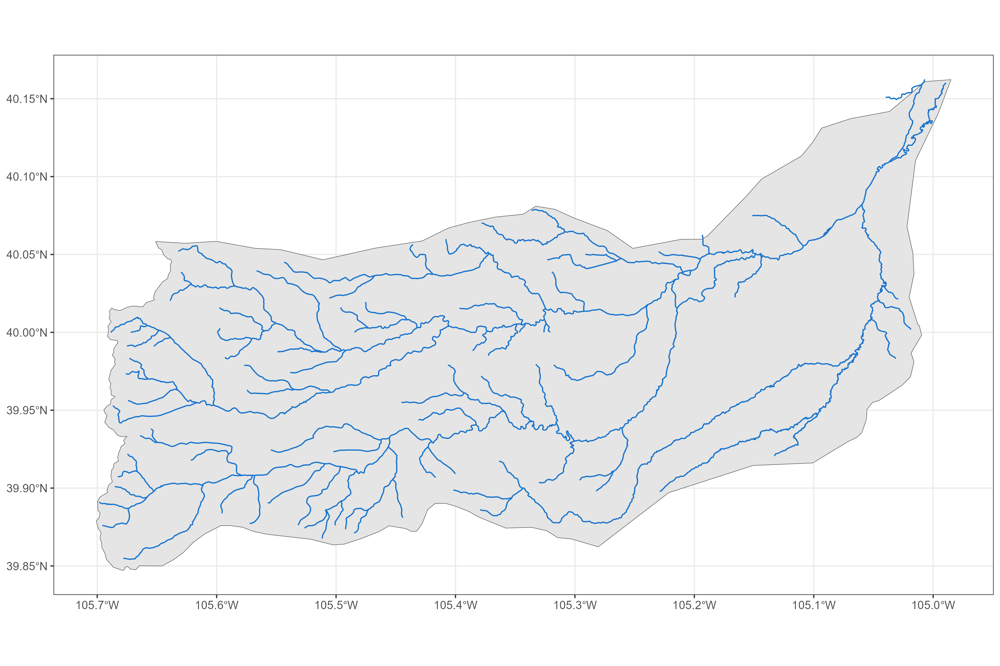

```{r, include = FALSE}
knitr::opts_chunk$set(
  collapse = TRUE,
  comment = "#>",
  # fig.path = "man/figures/README-",
  out.width = "100%"
)

library(sf)
library(cdssr)
library(nhdplusTools)
library(dplyr)
library(ggplot2)

districts <- sf::read_sf("data/water_districts_simple.geojson")
names(districts) <- tolower(names(districts))

thm <- 
  ggplot2::theme_bw() +
  ggplot2::theme(
    plot.title = ggplot2::element_text(size = 14),
    axis.text  = ggplot2::element_text(size = 10)
  )
```
# [**cpo**](https://github.com/anguswg-ucsb/cpo)
CPO data collection, aggregation, and analysis code repository 

The primary function of this repository is to provide reproducible scripts for collecting and summarizing water rights and climate data for the state of Colorado. 

<br>

## Data sources:

### Water Rights data sources:

1. CDSS/DWR via [cdssr](https://github.com/anguswg-ucsb/cdssr)

<br>

### Climate data sources:

1. SWE from NRCS SNOTEL sites

2. NRCS streamflow forecasts

3. EDDI (Evaporative Drought Demand Index)


The main script in this repository is the `get_everything()` script that when run, will pull together all available data from the sources above and summarize the data into an annual value for every point (water right) in each district.

## Data Collection steps:

<br>

### Area of Interest

For each water district in Colorado, we collect the same set of water right and climate data indicators. Below is a plot showing the different water district boundaries in Colorado. 

```{r, eval = FALSE, echo = FALSE}
# code for creating a map of all water districts in colorado 

districts_plot <- 
  districts %>% 
  dplyr::mutate(
    district = as.character(district),
    basin    = as.character(basin)
    ) %>% 
  ggplot2::ggplot() +
  ggplot2::geom_sf(ggplot2::aes(fill = basin)) +
  ggplot2::labs(
    # title = "Colorado water districts by basin",
    fill = ""
  ) +
  thm

ggplot2::ggsave(
  districts_plot,
  filename = "img/districts_plot.png",
  width    = 12,
  height   = 8,
  scale    = 1
  )

```


### Pick a district from district shapefile

We loop through each one of the water districts and apply the same data collection process for each water district. 
For this example, we will walk through the data collection process for a single district, district 6. 
```{r, eval = TRUE, echo = TRUE}
# subset to example district 6
aoi <-
  districts %>% 
  dplyr::filter(district == 6) %>% 
  dplyr::select(district, division, basin, name, geometry)

aoi
```


```{r, eval = FALSE, echo = FALSE}
# code for creating a map of all water districts in colorado 
aoi_plot <- 
  districts %>% 
  dplyr::mutate(
    district = paste0("District ", as.character(district)),
    basin    = as.character(basin)
    ) %>% 
  ggplot2::ggplot() +
  ggplot2::geom_sf(ggplot2::aes(fill = district)) +
  gghighlight::gghighlight(district == "District 6") +
  ggplot2::labs(
    # title = "Colorado water districts by basin",
    fill = ""
  ) +
  thm
# aoi_plot
ggplot2::ggsave(
  aoi_plot,
  filename = "img/aoi_plot.png",
  width    = 12,
  height   = 8,
  scale    = 1
  )

```


<br>

### Retrieve all river networks for the AOI
Use `NHDPlusTools`
First thing we do is we get NHDPlus flowlines for each district like so:

```{r, eval = TRUE, echo = TRUE}
flowlines <- nhdplusTools::get_nhdplus(AOI = aoi)

nrow(flowlines)
```

We've got 327 unique flowlines in district 6.

```{r, eval = FALSE, echo = FALSE}
# code for creating making an NHDPlus flowlines plot
fline_plot <- 
  # flowlines %>% 
  # dplyr::mutate(
  #   district = paste0("District ", as.character(district)),
  #   basin    = as.character(basin)
  #   ) %>% 
  ggplot2::ggplot() +
  ggplot2::geom_sf(data = aoi) +
  ggplot2::geom_sf(data = flowlines, color = "dodgerblue3") +
  # gghighlight::gghighlight(district == "District 6") +
  ggplot2::labs(
    # title = "Colorado water districts by basin",
    fill = ""
  ) +
  thm
# fline_plot
ggplot2::ggsave(
  fline_plot,
  filename = "img/fline_plot.png",
  width    = 12,
  height   = 8,
  scale    = 1
  )
```



<br>

### Subset to the largest/mainstem rivers
By stream level

<br>

### Determine most upstream point of river network
We'll use this point to determine which water right we want to use/get data for

<br>


### Get all water rights within AOI
Purpose is to get a unique water right identifier (or multiple) for each district

<br>

### Match water rights to upstream flowlines
Subset the water rights by river and determine which water right should be associated with each mainstems most upstream point. 

<br>

**To recap:**
For each district, we get the biggest river(s), find the most upstream point(s), 
and then find a water right(s) that represents the most upstream point(s) on each mainstem.

**Techniques used:**
<br>
- fuzzy string matching 
<br>
- basic distance/nearest neighbor calculation


### Get CDSS call data 
Use `cdssr` to get water right call data for each of our selected water rights in our district of interest/AOI

<br>

*MOST UPSTREAM WATER RIGHT AND PRESCRIBE THE MOST JUNIOR WATER RIGHT IMAGINABLE (99999.00000)*

<br>

--> Simulate what it would be like if you were at the top of the river and you had no water rights (i.e. all downstream users get first dibs on water)


