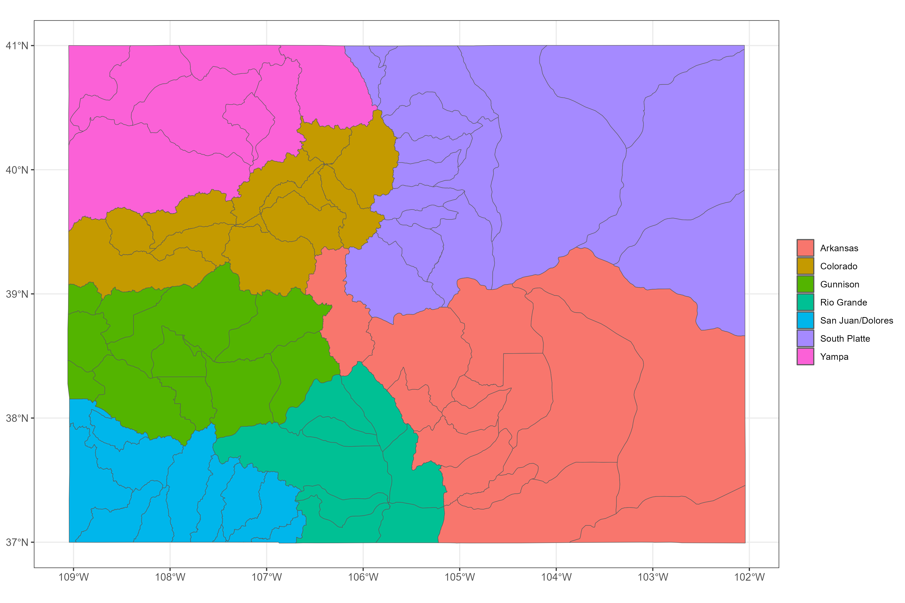
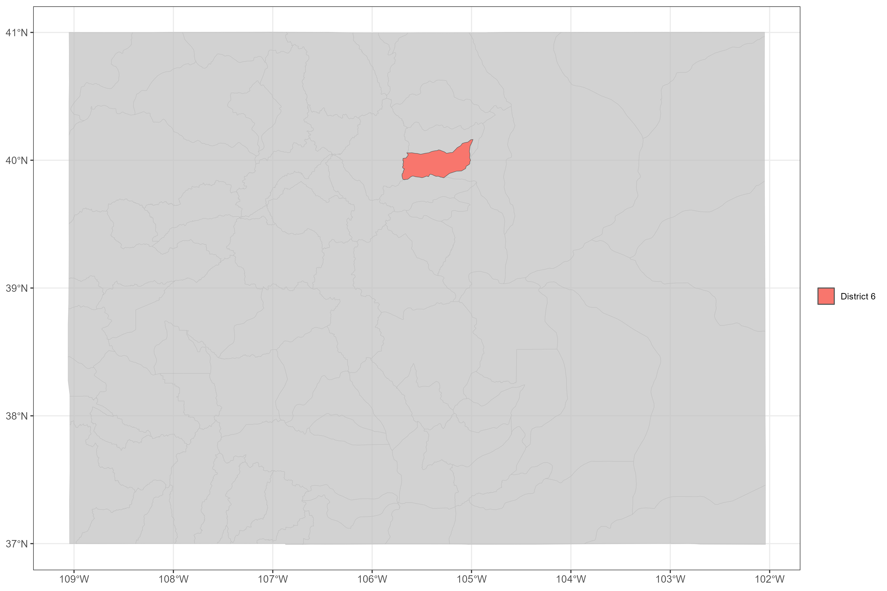
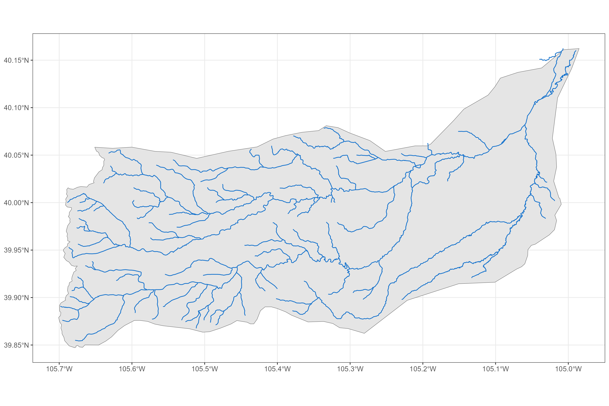
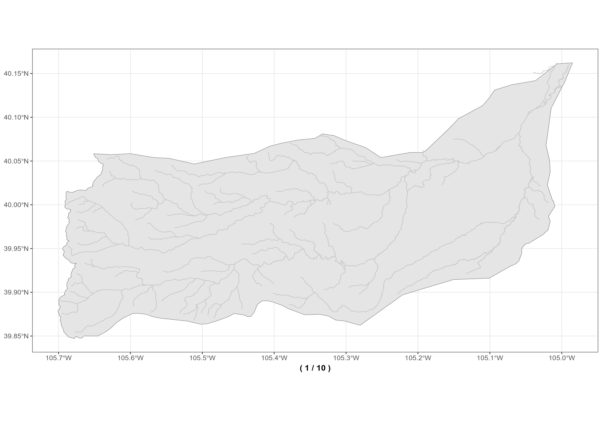

# [**cpo**](https://github.com/anguswg-ucsb/cpo)

CPO data collection, aggregation, and analysis code repository

The primary function of this repository is to provide reproducible
scripts for collecting and summarizing water rights and climate data for
the state of Colorado.

<br>

## Data sources:

### Water Rights data sources:

1.  CDSS/DWR via [cdssr](https://github.com/anguswg-ucsb/cdssr)

<br>

### Climate data sources:

1.  SWE from NRCS SNOTEL sites

2.  NRCS streamflow forecasts

3.  EDDI (Evaporative Drought Demand Index)

The main script in this repository is the `get_everything()` script that
when run, will pull together all available data from the sources above
and summarize the data into an annual value for every point (water
right) in each district.

## Data Collection steps:

<br>

### Area of Interest

For each water district in Colorado, we collect the same set of water
right and climate data indicators. Below is a plot showing the different
water district boundaries in Colorado.



### Pick a district from district shapefile

We loop through each one of the water districts and apply the same data
collection process for each water district. For this example, we will
walk through the data collection process for a single district, district
6.

``` r
# subset to example district 6
aoi <-
  districts %>% 
  dplyr::filter(district == 6) %>% 
  dplyr::select(district, division, basin, name, geometry)

aoi
#> Simple feature collection with 1 feature and 4 fields
#> Geometry type: POLYGON
#> Dimension:     XY
#> Bounding box:  xmin: -105.7008 ymin: 39.84716 xmax: -104.9851 ymax: 40.16224
#> Geodetic CRS:  WGS 84
#> # A tibble: 1 × 5
#>   district division basin        name                                   geometry
#>      <int>    <int> <chr>        <chr>                             <POLYGON [°]>
#> 1        6        1 South Platte Boulder Creek ((-105.6478 40.05384, -105.6488 …
```



<br>

### Retrieve all river networks for the AOI

Use `NHDPlusTools` First thing we do is we get NHDPlus flowlines for
each district like so:

``` r
flowlines <- nhdplusTools::get_nhdplus(AOI = aoi)
#> Spherical geometry (s2) switched off
#> although coordinates are longitude/latitude, st_intersects assumes that they
#> are planar
#> Spherical geometry (s2) switched on

nrow(flowlines)
#> [1] 327
```

We’ve got 327 unique flowlines in district 6.



<br>

### Subset to the largest/mainstem rivers

By stream level

We remove any divergent flowlines (streamcalc != 0) and then get a list
of all the unique streamlevels in our AOI. Below are the unique
streamlevels in ascending order:

``` r
streamlevels <- sort(unique(dplyr::filter(flowlines, streamcalc != 0)$streamleve))
```

We then select the top 2 largest streamlevels in our AOI

``` r
streamlevels <- streamlevels[1:3]
streamlevels
#> [1] 4 5 6
```

We then make sure to filter out any extraneous flowlines that are
outside the bounds of the AOI. We are then left with the top 3 most
promiment flowlines by streamlevel in our particular district of
interest. From each streamlevel, we then found the most downstream
flowline on that streamlevel by using the minimum Hydroseq attribute. We
then navigate up the river network, following the mainstem of the river
and find the most upstream flowline along the mainstem. The most
upstream flowline along the mainstem path of each streamlevel will end
up being the points we will use to decide which water rights (WDIDs) we
will select for each district. This process is illustrated in the gif
below.

    #> Warning: st_centroid assumes attributes are constant over geometries
    #> All intersections performed in latitude/longitude.
    #> Reading NHDFlowline_Network
    #> Spherical geometry (s2) switched off
    #> Spherical geometry (s2) switched on
    #> Writing NHDFlowline_Network
    #> All intersections performed in latitude/longitude.
    #> Reading NHDFlowline_Network
    #> Spherical geometry (s2) switched off
    #> Spherical geometry (s2) switched on
    #> Writing NHDFlowline_Network
    #> Warning: st_centroid assumes attributes are constant over geometries



<br>

### Get all water rights within AOI

Now that we have identified the mainstems within our AOI, and the most
upstream flowlines of these mainstems, we can use these upstream points
to identify the water rights we want to select for each district. First
we’ll get all the relevant water rights for the district, and remove any
missing data, removing data whose `water_source` is “GROUNDWATER”, and
applying a spatial filter to just points within 500 meters of a mainstem
river.

``` r
# get water rights information around most upstream of mainstems
water_rights <- cdssr::get_water_rights_netamount(
              water_district = "6"
              )
#> Retrieving water rights net amounts data

pts <-
  water_rights %>%
  dplyr::tibble() %>%
  dplyr::mutate(
    lon     = longitude,
    lat     = latitude,
    gnis_id = sub("^0+", "", gnis_id)
  ) %>%
  # dplyr::filter(wdid == "0604255") %>%
  dplyr::filter(!is.na(longitude) | !is.na(latitude)) %>%
  sf::st_as_sf(coords = c("longitude", "latitude"), crs = 4326) %>% 
  sf::st_filter(aoi) %>% 
  dplyr::filter(!grepl("GROUNDWATER", water_source)) %>% 
  sf::st_filter(
  sf::st_transform(
      sf::st_buffer(
        sf::st_union(mainstems), 500),
      4326
      )
  )

dplyr::select(pts, water_district, wdid, structure_type, water_source, gnis_id, appropriation_date)
#> Simple feature collection with 802 features and 6 fields
#> Geometry type: POINT
#> Dimension:     XY
#> Bounding box:  xmin: -105.6933 ymin: 39.87131 xmax: -105.0106 ymax: 40.14638
#> Geodetic CRS:  WGS 84
#> # A tibble: 802 × 7
#>    water_district wdid    structure_type water_source gnis_id appropriation_date
#>             <int> <chr>   <chr>          <chr>        <chr>   <chr>             
#>  1              6 0600501 Ditch          BOULDER CRE… 178354  1860-10-01 00:00:…
#>  2              6 0600501 Ditch          BOULDER CRE… 178354  1904-11-04 00:00:…
#>  3              6 0600501 Ditch          BOULDER CRE… 178354  1922-11-29 00:00:…
#>  4              6 0600501 Ditch          BOULDER CRE… 178354  1929-12-31 00:00:…
#>  5              6 0600501 Ditch          BOULDER CRE… 178354  1935-11-30 00:00:…
#>  6              6 0600502 Ditch          BOULDER CRE… 178354  1922-11-10 00:00:…
#>  7              6 0600503 Ditch          BOULDER CRE… 178354  1922-11-10 00:00:…
#>  8              6 0600504 Ditch          BOULDER CRE… 178354  1922-11-10 00:00:…
#>  9              6 0600505 Ditch          BOULDER CRE… 178354  1922-11-10 00:00:…
#> 10              6 0600506 Ditch          BOULDER CRE… 178354  1922-11-10 00:00:…
#> # ℹ 792 more rows
#> # ℹ 1 more variable: geometry <POINT [°]>
```

After subsetting our data, we have 802 unique water rights, which
correspond to 236 unique WDID locations

``` r
length(unique(pts$wdid))
#> [1] 236
```

<br>

We then identify the indices of the points nearest to most upstream
flowline, and thus we’ve found the most upstream WDIDs along our
mainstem flowlines.

``` r
# GET index of nearest points to each uppermost flowline
near_idx <- unique(
              unlist(
                lapply(1:nrow(upstream_fline), function(z) {
                  
                  sf::st_nearest_feature(
                    sf::st_transform(upstream_fline[z, ], 4326),
                    pts
                    )
                  })
                )
              )

# WDIDs of interest
pts[near_idx, ] %>% 
  sf::st_drop_geometry() %>% 
  dplyr::select(water_district, wdid, structure_type, water_source, gnis_id, appropriation_date)
#> # A tibble: 2 × 6
#>   water_district wdid    structure_type water_source  gnis_id appropriation_date
#>            <int> <chr>   <chr>          <chr>         <chr>   <chr>             
#> 1              6 0604256 Reservoir      NORTH BOULDE… 178467  1907-10-03 00:00:…
#> 2              6 0602105 Reservoir      SOUTH BOULDE… 180974  1976-03-17 00:00:…
```

<br>

The gif below illustrates the process of finding our most upstream WDIDs
for our district of interest


<br>

### Match water rights to upstream flowlines

Subset the water rights by river and determine which water right should
be associated with each mainstems most upstream point.

We then will do some fuzzy string matching to subset the water rights
points down to the same GNIS ID of our most upstream flow line points
(red points above). Now we only have points that match the same GNIS ID
of our upstream points, the next step we take is to find the nearest
neighboring water right point to each of our upstream mainstem
flowlines.

<br>

**To recap:** For each district, we get the biggest river(s), find the
most upstream point(s), and then find a water right(s) that represents
the most upstream point(s) on each mainstem.

**Techniques used:** <br> - fuzzy string matching <br> - basic
distance/nearest neighbor calculation

### Get CDSS call data

Now we have selected the WDIDs we will be using for our district of
interest/AOI. We can use the`cdssr` package to get [water right call
data](https://dwr.state.co.us/Rest/GET/Help/Api/GET-api-v2-analysisservices-callanalysisbywdid)
for each of our selected water rights in our district of interest/AOI.

<br>

The CDSS REST API provides an analysis service that allows you to
provide a WDID and an admin number and request a call analysis that
returns a time series showing the percentage of each day that the
specified WDID and priority was out of priority and the downstream call
in priority.

Given this information we decided to prescribe a “99999.00000” to each
of our upstream WDIDs, such that each of these WDID water right
locations is now representing the most junior water right possible.
simulate the experience of an extremely junior rights holder, located as
far upstream as possible (i.e. what it would be like if you were at the
top of the river and you had no water rights –\> all downstream users
get first dibs on water)

<br>
